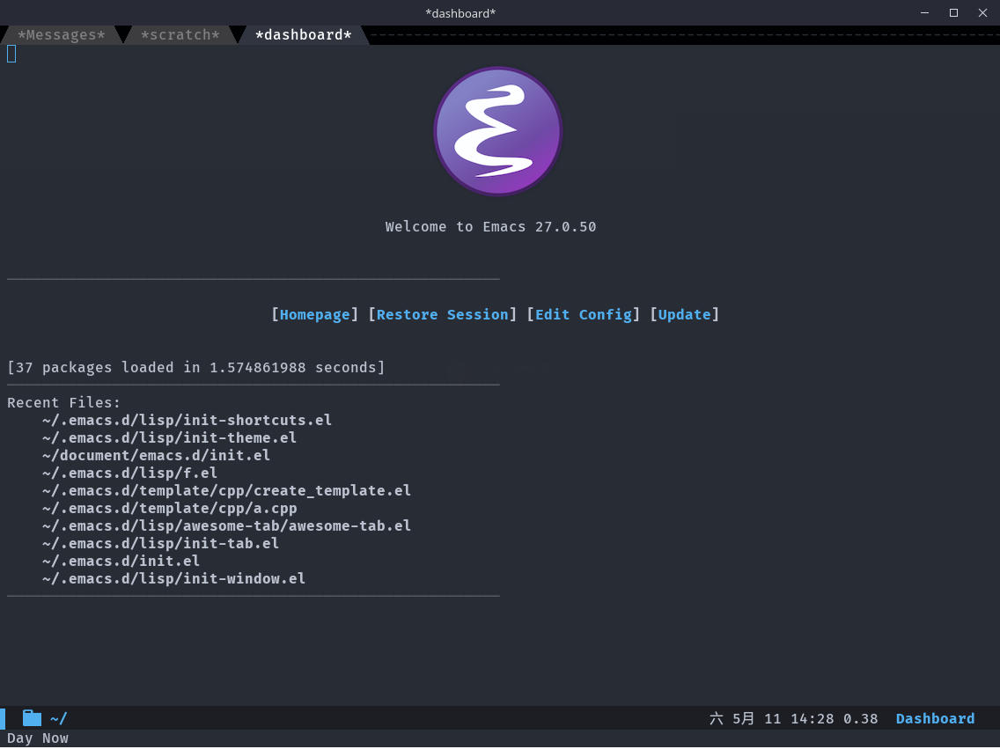
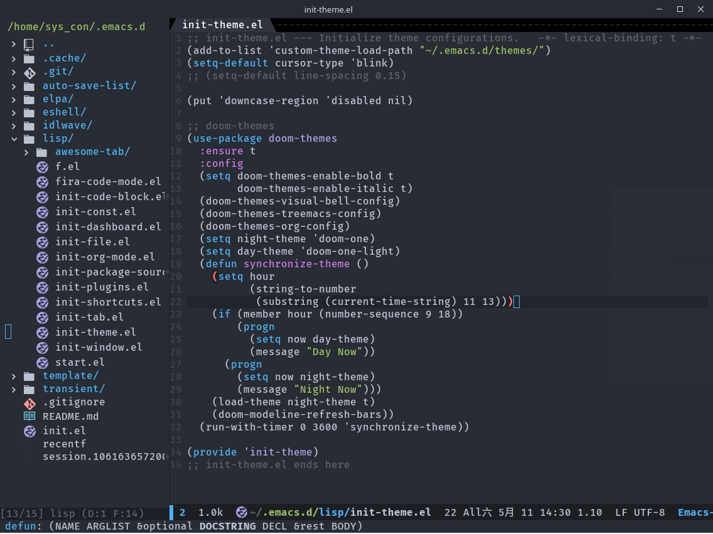

# A tiny but powerful Emacs config

## Supported Emacs versions
The config should run on Emacs 25.2 or greater because of some package.

(It'll give you a better experience if you work on Linux.)
## Installation
To install, clone this repo to `~/.emacs.d`.

Make sure that the `init.el` contained in the `.emacs.d`.
```shell
git clone https://github.com/SysConKonn/emacs.d.git ~/.emacs.d
```
The third-party packages will be automatically downloaded and installed when you start it for the first time.

It'll take at most 1 minute.

## Update
You can update the config with `git pull`.

## FiraCode Fonts Supported
You can use FiraCode font in this config by command `M-x fira-code-mode RET` if you have FiraCode font.

## Attention

+ If some error occurs to the icons, you could use `M-x all-the-icons-install-fonts RET`
+ If you see "Warning (package): Unnecessary call to ‘package-initialize’ in init file", you could remove `(package-initialize)` in `init.el` at 4th line.

## Screenshot



